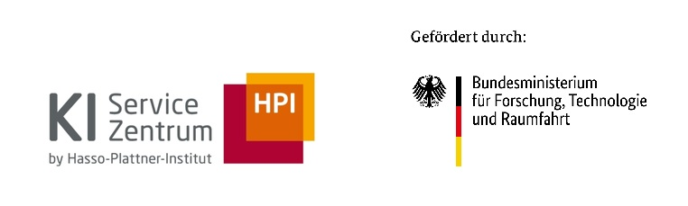

<div style="background-color: #ffffff; color: #000000; padding: 10px;">

<h1>Sentra – RAG for Wissenschaftliche Dienste</h1>
</div>

[](https://github.com/aihpi/pilotproject-sentra/actions/workflows/ci.yml)

A Retrieval-Augmented Generation (RAG) prototype that enables semantic search and question-answering over documents from the Wissenschaftliche Dienste des Deutschen Bundestages.

## Architecture

```
┌──────────┐      ┌──────────┐      ┌──────────┐
│ Frontend │─────▶│ Backend  │─────▶│  Qdrant  │
│ React    │ :5173│ FastAPI  │ :8001│ VectorDB │ :6333
└──────────┘      └──────────┘      └──────────┘
                        │
                   AI Hub API
                  (Embeddings +
                   Generation)
```

### Ports

One set of numbers, used everywhere. Host ports are what you open in a browser;
container ports are what `nginx.conf`, the Dockerfiles and the Kubernetes
manifests talk to.

| Service | Host | In container | Where the host port comes from |
|---------|------|--------------|-------------------------------|
| Frontend | 5173 | 80 | `docker compose` maps it, and `vite.config.ts` uses the same for `npm run dev` |
| Backend | 8001 | 8000 | `docker compose` maps it; run `uvicorn --port 8001` locally to match |
| Qdrant | 6333 / 6334 | 6333 / 6334 | mapped straight through |

The backend only allows CORS from `http://localhost:5173`, since that is the one
origin that calls it cross-origin. Under `docker compose` nothing does: nginx
proxies `/api` to the backend, so the browser sees a single origin.

- **Frontend** — React + Vite + Tailwind + shadcn/ui
- **Backend** — FastAPI + Docling (PDF parsing) + OpenAI-compatible AI Hub
- **Vector DB** — Qdrant (cosine similarity, 4096-dim embeddings)
- **Models** — Octen-Embedding-8B (embeddings), llama-3-3-70b (generation)

## Prerequisites

- **Docker & Docker Compose** (for Docker setup)
- **Node.js >= 20** and **Python >= 3.12 with [uv](https://docs.astral.sh/uv/)** (for local dev)
- **AI Hub credentials** (base URL + API key)

---

## Option 1: Docker (recommended)

The simplest way to run the full stack.

### 1. Configure environment

```bash
cp 02_backend/.env.example .env
```

Edit `.env` and set your AI Hub credentials:

```
AI_HUB_BASE_URL=https://your-hub-url.example.com/v1
AI_HUB_API_KEY=your-virtual-key-here
```

The rest of the defaults work as-is for Docker.

### 2. Start all services

```bash
docker compose up --build
```

This starts three services:
| Service | URL | Description |
|---------|-----|-------------|
| Frontend | http://localhost:5173 | Search UI |
| Backend | http://localhost:8001 | FastAPI + Swagger docs at `/docs` |
| Qdrant | http://localhost:6333 | Vector DB dashboard |

Those are the host ports. Inside the container network the services listen on
80, 8000 and 6333, which is what `nginx.conf` and the Kubernetes manifests use.

### 3. Ingest documents

Put the PDFs you want indexed in `03_data/Ausarbeitungen/`. That directory is not
tracked, so a fresh clone starts empty, and ingestion reads one directory without
recursing. See `03_data/README.md`.

Then open the frontend at http://localhost:5173, navigate to **Dokumente**, and click
**Dokumente einlesen**. This parses those PDFs and indexes them into Qdrant.

Alternatively, via API:

```bash
curl -X POST http://localhost:8001/api/ingest
```

### 4. Search

Go to the **Suche** tab and ask a question in German, e.g.:

> Welche Regelungen gelten für die Immunität von Abgeordneten?

### Stop

```bash
docker compose down
```

To also clear the vector database:

```bash
docker compose down -v
```

---

## Option 2: Local Development (without Docker)

Run each component separately for faster iteration.

### 1. Start Qdrant

You still need Qdrant running. The easiest way is via Docker:

```bash
docker run -p 6333:6333 -p 6334:6334 qdrant/qdrant:latest
```

### 2. Backend

```bash
cd 02_backend

# Create and configure environment
cp .env.example .env
# Edit .env — set AI_HUB_BASE_URL, AI_HUB_API_KEY
# The example file already points DOCUMENTS_DIR at ../03_data/Ausarbeitungen,
# which resolves correctly when you run the server from 02_backend.

# Install dependencies
uv sync

# Run the server
uv run uvicorn sentra.main:app --reload --host 0.0.0.0 --port 8001
```

The backend is now at http://localhost:8001 (Swagger UI at http://localhost:8001/docs).

### 3. Frontend

```bash
cd 01_frontend

# Install dependencies
npm install

# Run dev server
npm run dev
```

The frontend is now at http://localhost:5173 and calls the backend at `localhost:8001`, which is what `01_frontend/.env.development` sets.

### 4. Ingest & search

Same as Docker — navigate to **Dokumente** → **Dokumente einlesen**, then switch to **Suche**.

---

## Project Structure

```
├── 00_aisc/              # Branding assets (HPI/AISC logos)
├── 01_frontend/          # React frontend
│   ├── src/
│   │   ├── components/   # UI components
│   │   ├── lib/          # API client, utilities
│   │   └── types/        # TypeScript interfaces
│   └── Dockerfile
├── 02_backend/           # FastAPI backend
│   ├── src/sentra/
│   │   ├── api/          # Routes, request/response models
│   │   ├── ingestion/    # PDF parsing, metadata extraction, chunking
│   │   ├── rag/          # Embeddings, vector store, answer generation
│   │   └── services/     # Ingestion and query orchestration
│   └── Dockerfile
├── 03_data/              # Document corpus, not tracked. See 03_data/README.md
│   └── Ausarbeitungen/
└── docker-compose.yml
```

## API Endpoints

| Method | Endpoint         | Description                             |
| ------ | ---------------- | --------------------------------------- |
| `POST` | `/api/query`     | Ask a question (supports SSE streaming) |
| `POST` | `/api/ingest`    | Parse and index all PDFs                |
| `GET`  | `/api/documents` | List indexed documents                  |
| `GET`  | `/api/health`    | Health check + Qdrant status            |

---

## Acknowledgements


The [AI Service Centre Berlin Brandenburg](http://hpi.de/kisz) is funded by the [Federal Ministry of Research, Technology and Space](https://www.bmbf.de/) under the funding code 01IS22092.
